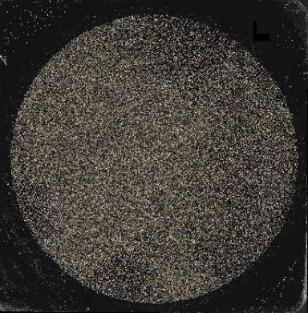
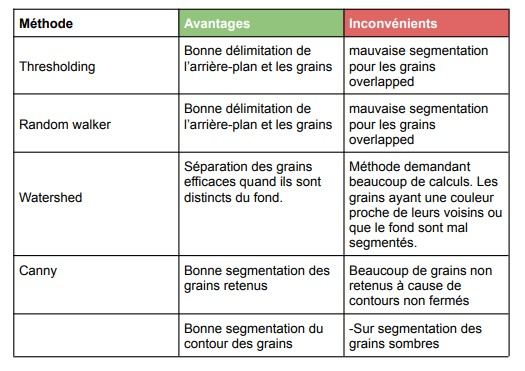
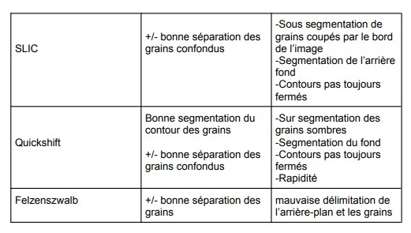
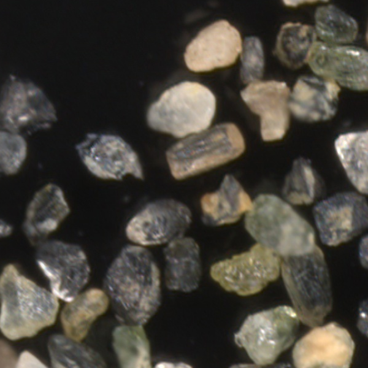
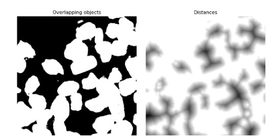
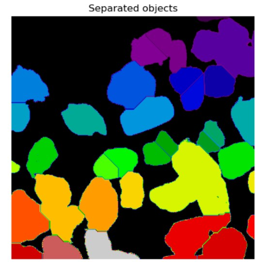
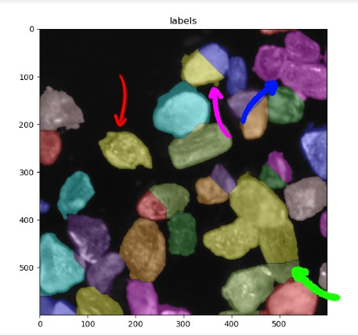
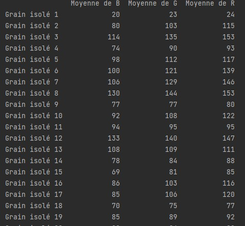

# TNI-TP2 

8INF804-Traitement numerique des images.
Hiver 2022
Professeur : Julien Lemaitre

Contributeurs
Nihal OUHAOUADA 
Pierre LACLAVERIE 
Thibaud SIMON 
Yann REYNAUD 

# Sommaire 
- [TNI-TP2](#tni-tp2)
- [Sommaire](#sommaire)
- [Objectif du travail : Segmentation de roches](#objectif-du-travail--segmentation-de-roches)
- [Méthode](#méthode)
  - [Conclusion sur la méthode](#conclusion-sur-la-méthode)
- [Extraction des données](#extraction-des-données)

Ici le [Sujet](TP2/Ress/pdf/Sujet%20-%20TP2.pdf) ainsi que le [Compte-rendu](TP2/Ress/pdf/Rapport.pdf)

Ce projet a ete fait en python avec notamment l'utilisation d'opencv en python.

# Objectif du travail : Segmentation de roches

Nous devons utiliser des outils pour traiter des images
(ex. : rehaussement des contrastes, rehaussement des couleurs) afin de réaliser une segmentation de roches broyées sur une lame.

Mise en contexte : les photos que vous aurez à traiter sont issues d’un microscope optique avec
une caméra HD intégrée. Plus exactement, celles-ci représentent des sous-parties d’un échantillon
(une seule image) de roches broyées en grain. Chaque grain représente un minéral (une espèce
minérale). L’échantillon ci-dessous possède une taille de 2.5 cm de diamètre (poids de
l’image ~2Go)

# Méthode

Pour arriver à la meilleure segmentation, nous avons testé différentes méthodes pour au mieux résoudre ce problème :

- Watershed
- Seuillage
- Random Walker
- Canny + Filling
- SLIC
- Quickshift 
- Felzenszwalb

Après les avoir implémentées et les avoir comparées,nous avons dressé un tableau récapitulatif pour résumer leurs points forts et points faibles.

Ci dessous le tableau.

et 

Nous avons choisis d'utiliser le watershed pour la segmentation. 

L'introduction à la méthode se trouve dans le [rapport](TP2/Ress/pdf/Rapport.pdf) section Watershed

En premier lieu, la [méthode des triangles](https://www.researchgate.net/figure/The-triangle-algorithm-selects-the-threshold-intensity-as-the-value-where-the-distance_fig6_240695844) est utilisée pour effectuer un threshold; en effet l'image étant essentiellement composée de fond, cette méthode permets de mettre en avant. 

On applique la fonction distance à l'image binaire récupérée. Visuellement on a cela :

Image d'origine : 

Seuillage et fonction distance 

La distance utilisée est la distance euclidienne.

Ensuite on applique une ligne de partage des eaux, on obtient cette image :

Enfin, on supperpose l'image labbelisée avec l'image d'origine pour voir le résultat final : 

On peut voir que la segmentation au global est bien faite, on a bien l'entiereté des cailloux qui sont reconnus.
Cependant, le programme fait des erreurs sur la labellisation.

Il y a quatre grandes catégories : 
- La **bonne** segmentation, le grain est assez bien segmenté : flèche rouge
- La **sur segmentation**,le grain est divisé en plusieurs grains par le programme : flèche violette.
- La **sous segmentation**, plusieurs grains sont considérés comme étant le même grain par le programme : fleche bleu.
- La **mauvaise segmentation** : le label des images s'éloigne fortement de la réalité: flèche verte. Dans le cas soulevé ici 4 grains sont en réalité considérés comme deux. Un grain [réel] est labellisé comme faisant partie à la fois de deux grains [labels].

## Conclusion sur la méthode

Cette méthode est particulièrement efficace lorsque l’image présente de fortes régions distinctes, comme par exemple le contour d’un grain blanc sur fond noir. A contrario, si l’objet a des couleurs similaires au fond ou aux objets superposés, cette méthode est peu efficace. Plus les maximaux locaux sont marqués, meilleure sera la segmentation.  

# Extraction des données

Comme le sujet nous le demandait, nous avons extrait les données des grains labellisés, on obtient le tableau suivant. Le programme créé un fichier .csv pour récuperer ces données.

